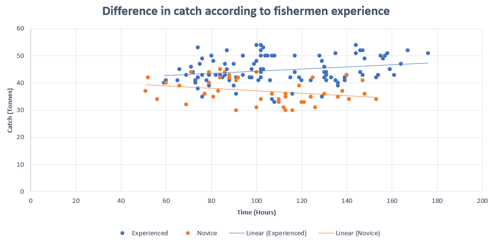

# Table of Contents

[About](#about)

[Tech Stack](#tech-stack)

[Portfolio Projects](#portfolio-projects)

&nbsp;&nbsp;***R / Statistical Analysis***

- [Vehicle Age & Passenger Impact on Tire-Related Fatalities in Ford SUVs (1995-1999)](#vehicle-age--passenger-impact-on-tire-related-fatalities-in-ford-suvs-1995-1999-) 
- [The Effects of Land Characteristics on Animal Abundance](#the-effects-of-land-characteristics-on-animal-abundance-)

&nbsp;&nbsp;***Excel / Data Analysis***

- [Data analysis of factors related to fish quantity caught in Tasmanian waters](#data-analysis-of-factors-related-to-fish-quantity-caught-in-tasmanian-waters-)

&nbsp;&nbsp;***Power Point / Psychometric Testing***

- [Evaluation of Best Psychometric Test for Resilience Among Elder Australians](#evaluation-of-best-psychometric-test-for-resilience-among-elder-australians-)

[My Certificates](#my-certificates)

[Contact Me](#contact-me)

# About

Hi, I'm Julie-Ann. I have a background in psychology and I am passionate about understanding how data can offer insights and predictability about the world around us, from human mental health, animal behaviour to everyday occurrences.

During my studies, I have worked with datasets using statistical techniques such as regression analysis, hypothesis testing, and descriptive data analysis.

This repository displays several projects that demonstrate my ability to analyse data and answer proposed research questions.
 
 
# Tech Stack 

 
 
# Portfolio Projects
## [Vehicle Age & Passenger Impact on Tire-Related Fatalities in Ford SUVs (1995-1999) 📌](https://github.com/Julie-AnnB/Resources/blob/main/Tire_Related_Accidents.md)

**Task**  
The aim of the study was to examine data on tire-related fatal car accidents and to uncover whether, among the observed cases, the odds of such crashes were significantly higher for Ford Explorers compared to other car makes, after accounting for vehicle age and passenger numbers. Additionally, the study sought out to test if the number of passengers and the vehicle's model year were related to the odds of tire-related accidents. This was assessed to address concerns that heavy loads or car age may have contributed to these cases. Finally, the analysis was used to develop a statistical model predicting the odds of tire-related accidents based on car make, number of passengers and vehicle age.

**Findings**  
The analysis showed that Ford SUVs had a higher probability of being involved in tire-related accidents than other car makes (Figure below).

**Conclusion**  
The results of the study supported both predictions. In particular, the analysis suggested that the odds for Ford vehicles were about 17 times higher than other SUVs. Furthermore, the findings showed that each extra year in car age more than doubled the odds of a tire-related accident, while each additional passenger nearly doubled the odds. Simply put, heavier loads and older cars, increased the odds for Ford tire-related crashes compared to other makes.

**Statistic Skills**  
Data wrangling, data visualisation, hypothesis testing, logistic regression.

**Tech Software**  

 

## [The Effects of Land Characteristics on Animal Abundance 📌](https://github.com/Julie-AnnB/Resources/blob/main/Abundance_Quarto_Final_2.md)

**Task**  
The aim of this study was to examine how forest fragmentation affects bird abundance. Eight forest patch characteristics were evaluated and fitted to a model to identify the main determinants of bird numbers. The dataset comprised observations from 56 independent forest patches.

**Findings**  
The analysis showed that the relationship between patch size and bird abundance was positive: larger patches held larger bird numbers. In the figure below (Left) the black line represents the relationship between patch size and bird abundance. The prediction intervals (red dotted lines) show the model was more accurate for patches under 5 ha. Note: the patch axis has been magnified to improve visibility. Further, the relationship between light and heavy grazing practices can be explained by a parallel linear relationship (Figure Right). The red line represent bird abundance in patches with light grazing and black line represent bird abundance in heavily grazed patches. The parallel model suggests that lightly grazed patches support more birds than the heavily grazed plots, while holding patch size constant.

 

  

**Conclusion**  
It might be important investigate why only light and heavy grazing intensities were significantly different, as this may signal that unidentified predictors mediate the relationship between grazing intensities and bird abundance (supports by the unexplained leftover 30% variance). Lastly, the results may have practical implications for land developers: increase patch sizes and reduce grazing practices to boost bird numbers

**Statistic Skills**  
Data visualisation, hypothesis testing, multiple regression.

**Tech Software**  

 

## [Data analysis of factors related to fish quantity caught in Tasmanian waters 📌](https://github.com/Julie-AnnB/Resources/blob/main/Excel%20write%20up.pdf)

**Task** 
The analysis below provides an insight into the factors related to the fishing performances of Tasmanian skippers, such as the weight of caught fish known as 'Catch', and the dollar per hour value of caught fish, colloquially referred to as 'Effectiveness'. This observational study examined data about 152 Tasmanian fishing boats. Besides 'Catch' figures, other data collected were the dollar value of caught fish per vessel known as 'Value', skippers' level of fishing experience labelled as 'Experienced', the boat port of origin known as 'Port', the quality of sonar equipment labelled as 'Search', length of fishing trip categorised as 'Time', and lastly, fishermen preference between shallow or deep-water fishing classified as 'Depth'.

**Findings**  
Overall, experienced skippers caught an additional 5,990 to 9,180 kg of fish compared to inexperienced fishermen (Graph below). Similarly, experienced fishers showed an advantage in the value of caught fish per hour. Specifically, experienced anglers were catching fish at a rate of 40.11 to 189.07 $/h compared to inexperienced skippers.
Furthermore, experienced skippers who used sophisticated search equipment caught on average 2,860 to 7,020 kg more fish than inexperienced fishers who used the same search gear. Similarly, experienced anglers with adequate sonars caught 7,190 to 11,370 kg more fish than novice fishermen with adequate sonars. 

 

**Conclusion**  
These two observations point out that the experienced skippers had caught markedly more fish than inexperienced fishermen despite the type of sonar equipment, and experience matters more than effort.

**Statistic Skills**  
Data cleaning, pivot tables, t-tests, data visualisation.

**Tech Software**  

 

## [Evaluation of Best Psychometric Test for Resilience Among Elder Australians 📌](https://github.com/Julie-AnnB/Resources/blob/main/Psychometric_testing_PP.pdf)

**Task**  
Select the most psychometrically sound scale to measure resilience among late adult Australians. In particular, the Connor-Davidson Resilience Scale (Connor & Davidson, 2003) versus the RS25 (Wagnild & Young, 1993). The task involved research on the characterisitcs of elder Australians and how to define and measure the concept of resiliance. 

**Findings**  
As the original RS was developed with an old adult sample, its cross-cultural stability and shorter time to complete, it was a more appropriate scale to reflect and measure resilience among old adult Australians.

**Statistic Skills**  
Data Visualisation, Validity, Reliability, Floor and Ceiling Effects.

 

**Tech Software**  

 

# My Certificates

Google Data Analytics Professional Certificate (in progress)

# Contact Me

email@email.com
